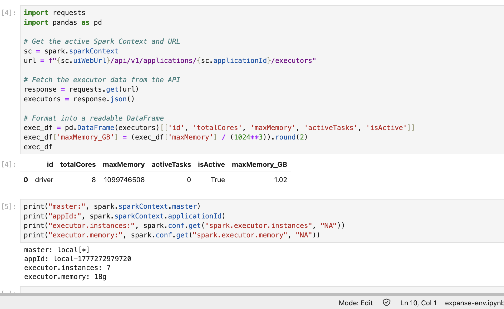
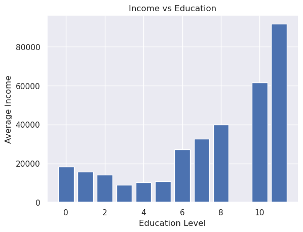
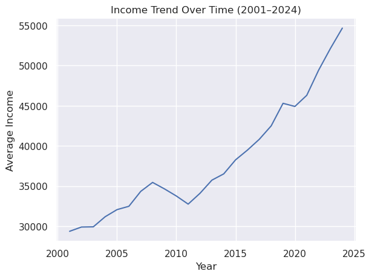
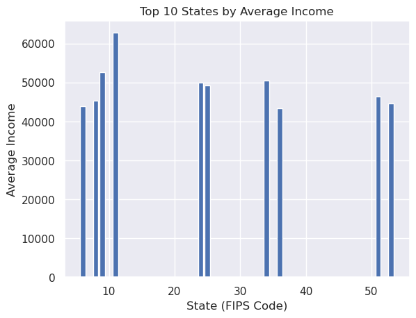
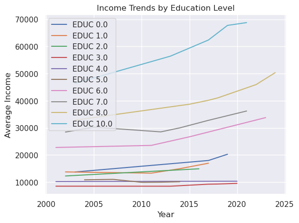
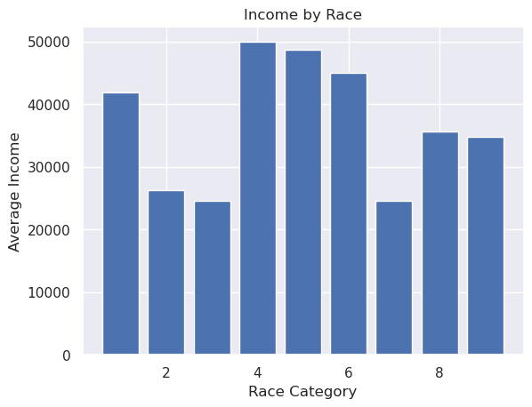
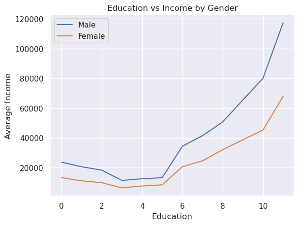

# dsc232r-group-project
Group project for DSC 232R: Big Data Analytics Using Spark


## Dataset Linkage

- Primary dataset: [IPUMS USA](https://usa.ipums.org/usa/)
- Data access portal: [IPUMS USA Extract System](https://usa.ipums.org/usa-action/variables/group)
- Citation: Steven Ruggles, Sarah Flood, Matthew Sobek, Daniel Backman, Grace Cooper, Julia A. Rivera Drew, Stephanie Richards, Renae Rodgers, Jonathan Schroeder, and Kari C.W. Williams. *IPUMS USA: Version 16.0* [dataset]. Minneapolis, MN: IPUMS, 2025. [https://doi.org/10.18128/D010.V16.0](https://doi.org/10.18128/D010.V16.0)

## Abstract

In this project, we will analyze data from the IPUMS USA dataset (https://usa.ipums.org/usa/), which provides harmonized U.S. census and survey data across multiple years. We will construct a dataset spanning 2001 to 2024 that includes variables such as total income, educational attainment, geographic region or state, survey year, age, sex, and employment status, with a total size exceeding 10 GB with millions of records. Our research investigates how the relationship between education and income varies across regions and time, and to what extent education predicts income across different geographic regions. Due to the large scale and complexity of the data, which includes millions of records across multiple years, this analysis cannot be efficiently performed on a standard laptop with limited memory and computational power. We will use distributed computing frameworks such as Spark to process and analyze the data at scale.

## SDSC Expanse Environment Setup 

Notebook: [`expanse-env.ipynb`](./expanse-env.ipynb)

For our setup, we requested `8` cores and `128GB` total memory.


Allowing us to do:

```python
spark = SparkSession.builder \
    .config("spark.driver.memory", "2g") \
    .config("spark.executor.memory", "18g") \
    .config("spark.executor.instances", 7) \
    .getOrCreate()
```

Formula for the above:

- Executor instances = Total Cores - 1
- Executor memory = (Total Memory - Driver Memory) / Executor Instances

Our calculation:

- Total Cores = `8`
- Total Memory = `128GB`
- Driver Memory = `2GB`
- Executor Instances = `8 - 1 = 7`
- Executor Memory = `(128 - 2) / 7 = 18GB` 


### SparkSession Configuration and Justification

When going through [Spark on HPC Best Practices: Example 3](https://github.com/ucsd-dsc232r/group-project/blob/main/SPARK_HPC_BEST_PRACTICES.md#example-3-8-cores-with-128gb-ram-high-memory), this setup most closely aligned with our needs. Since our data is 65GB, it's a fair amount above the 50GB that is mentioned in this example. 


Spark executor/config evidence during data loading:



## Data Exploration using Spark

Notebook: [`data-exploration.ipynb`](./data-exploration.ipynb)

All data exploration in this section was done using Spark DataFrames.

### Number of Columns and Rows

| Metric | Value |
|---|---:|
| Number of Rows | 67,125,780 |
| Number of Columns | 238 |

### Target Columns

Our columns of main interest are "YEAR", "STATEFIP", "SEX", "AGE", "RACE", "EDUC", and "INCTOT". EDUC and INCTOT are the major relavant columns to directly answer our abstract. YEAR will provide chronological information, STATEFIP will provide spatial information, and SEX, AGE, and RACE can provide further data partitioning to reveal trends and patterns on sex, age, and race.
The full dataset contains 238 columns, and complete descriptors for all variables are available in both [`usa_00001.xml`](./usa_00001.xml) and the [IPUMS variable documentation website](https://usa.ipums.org/usa-action/variables/group).

- YEAR (Numerical): The year the data was collected.
- STATEFIP (Categorical): The US state the data was collected using the FIPS (Federal Information Processing Standards) coding scheme.
- SEX (Categorical): Whether the person was male or female
- AGE (Numerical): The person's age in years.
- RACE (Categorical): The person's race.
- EDUC (Categorical): The person's educational attainment.
- INCTOT (Numerical): The person's pre-tax total personal income (or loss).

All categorical variables have some numeric coding scheme which correspond with qualitative categories. The coding scheme for these variables can be found in the code box below. These coding schemes and descriptions are found on the [IPUMS website](https://usa.ipums.org/usa-action/variables/group).

### Descriptive statistics for Numeric data

| summary | YEAR | AGE | INCTOT |
|---|---:|---:|---:|
| count | 67,125,780 | 67,125,780 | 67,125,780 |
| mean | 2013.8564 | 40.7865 | 1,774,229.3693 |
| stddev | 6.3780 | 23.5751 | 3,777,923.4429 |
| min | 2001.0 | 0.0 | -19998.0 |
| max | 2024.0 | 97.0 | 9999999.0 |

Our dataset captures survey results between 2001 and 2024. Our age range is between 0 and 97 years old with an average age of approximately 41 years old. Since the maximum age is 97, there are no missing data because the assigned code for missing data is 999. According to the IPUMS website, for our dataset which covers 2001-2024, there are special codes to indicate certain circumstances:

- 0000000 = None
- 0000001 = $1 or break even (2000, 2005-onward ACS and PRCS)
- 9999999 = N/A
- 9999998 = Unknown

### Checking for Duplicates

Due to the large size of the dataset, it's difficult to look for duplicate rows on all rows. Instead, we will rely on the PERNUM column which uniquely identifies a person. We will combine this with YEAR (since the same person can respond multiple times across years) to identify potential duplicates. Also, as advised by the IPUMS website: "When combined with SAMPLE and SERIAL, PERNUM uniquely identifies each person within the IPUMS." As a safety precaution, we will use all 4 columns to uniquely identify a person's survey response in order to identify duplicates.

| Metric | Value |
|---|---:|
| Unique (`YEAR`,`PERNUM`,`SAMPLE`,`SERIAL`) | 67,125,780 |
| Duplicates | 0 |

There are no duplicates.

### Counting Nulls

| Column | Null count |
|---|---:|
| YEAR | 0 |
| STATEFIP | 0 |
| SEX | 0 |
| AGE | 0 |
| RACE | 0 |
| EDUC | 0 |
| INCTOT | 0 |

We can see that there are no null values in these columns. However, it remains to be seen if the unavailable data defined by the coding schemes (e.g. 99 for EDUC column) are present in the data. This will be known in the next few sections.

### Special-code check for `INCTOT`

| INCTOT value | count |
|---:|---:|
| 0.0 | 6,773,579 |
| -19998.0 | 196 |
| 1.0 | 6,266 |
| 9999999.0 | 11,690,872 |

There are multiple instances of 9999999, indicating missing data. There are no instances of 9999998, and there are a significant number of instances of 0. This is likely a nice round number that survey participants would use to indicate that they had no income that year. To a lesser degree, the same could be said about the number of instaces of 1. The relatively low count of -19998 instances indicate that this is simply a lower bound, though it will be more clear in the plots section.

If we remove the instances of 9999999, the income distribution is:

| summary | INCTOT |
|---|---:|
| count | 55,434,908 |
| mean | 39,466.5038 |
| stddev | 59,723.0848 |
| min | -19998.0 |
| max | 1,945,000.0 |

The income distribution appears to be between -19998 and 1945000 dollars with a mean income of 39466.50 dollars.

## Data Plots

Notebook: [`data-plots.ipynb`](./data-plots.ipynb)

Visualizations in this section are generated from Spark DataFrame aggregations and then plotted with `matplotlib`.

### Plot 1: Income vs Education



The chart shows a strong positive relationship between education level and average income, where earnings generally increase as education rises. Lower education levels (around 0–5) are associated with relatively low incomes (under ~20k), but there is a noticeable jump starting around mid-level education, and incomes increase sharply at higher levels, reaching above 60k–90k for the highest categories. This suggests that higher education significantly boosts earning potential, with the largest gains occurring at advanced levels rather than early stages of education.

### Plot 2: Income Trend Over Time (2001-2024)



The chart shows a clear long-term upward trend in average income from 2001 to 2024, rising from around 29k to nearly 55k, indicating steady economic growth over time. There is a noticeable dip around 2009–2011, likely reflecting an economic downturn, after which income resumes a consistent upward trajectory. Growth appears to accelerate after about 2015, with especially strong increases in the most recent years, suggesting improving economic conditions or rising wages, although the sharp rise toward the end could also reflect inflation or other external factors rather than purely real income growth.

### Plot 3: Top 10 States by Average Income



The chart shows that among the top 10 states, average income is relatively high but not evenly distributed—one state clearly leads (around ~63k), while the rest cluster in a slightly lower band (~43k–52k). This suggests a small number of states have a stronger concentration of high-paying industries or economic opportunities, creating a noticeable gap even within the top tier. Overall, it highlights that high income in the U.S. is concentrated in a few leading states rather than being uniformly spread across all top performers.

### Plot 4: Income Trends by Education Level



The chart shows that average income rises over time for all education levels, but the increase is much stronger at higher levels of education, leading to a widening gap between low- and high-educated groups. Lower education categories (EDUC 0–3) remain in the lower income range (roughly ~8k–17k) with only modest growth, while higher categories (like EDUC 7–10) show steady and much larger increases, reaching significantly higher income levels over time. This highlights that higher education not only leads to higher earnings but also benefits more from economic growth over time. In IPUMS, EDUC values represent attainment levels: for example, EDUC 0 = no schooling/N/A, 1 = elementary (up to ~4th grade), 2 = middle school (5th–8th), 3 = early high school (around 9th grade), meaning these lower codes correspond to relatively low levels of formal education.

### Plot 5: Income by Race



The chart shows noticeable differences in average income across race categories, with some groups earning significantly higher (around ~45k–50k) while others are clustered much lower (around ~24k–27k), indicating clear income disparities across racial groups. A few categories stand out as top earners, while others consistently lag behind, suggesting unequal economic outcomes that may reflect differences in access to education, occupations, or systemic factors. In the IPUMS dataset, race is coded numerically, where common categories include 1 = White, 2 = Black/African American, 3 = American Indian/Alaska Native, 4 = Chinese, 5 = Japanese, 6 = Other Asian or Pacific Islander, 7 = Other race, 8 = Two major races, 9 = Three or more races, meaning each bar represents one of these racial groups rather than a continuous scale.

### Plot 6: Education vs Income by Gender



The chart shows that income increases with education for both males and females, but males consistently earn more at every education level, and the gap widens as education increases.

## Preprocessing Plan 


## Team Contact

For project questions, reach out to:

- Edwin Vargas Navarro: [evargasnavarro@ucsd.edu](mailto:evargasnavarro@ucsd.edu)
- Evan Lim: [e2lim@ucsd.edu](mailto:e2lim@ucsd.edu)
- Jiamin Wu: [jiw294@ucsd.edu](mailto:jiw294@ucsd.edu)
- Noopur Chowdary: [nchowdary@ucsd.edu](mailto:nchowdary@ucsd.edu)